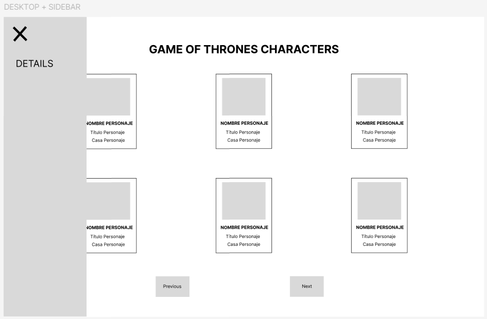

# Synlab

Esta es una aplicación desarrollada en React que consume datos desde una API de Game of Thrones. La aplicación cuenta con un diseño responsive, implementa paginación y utiliza componentes reutilizables para la navegación y la visualización de los personajes.

## Tecnologías y dependencias

La aplicación utiliza las siguientes tecnologías y dependencias:

### Dependencias

- **axios**: ^1.7.7
- **react**: ^18.3.1
- **react-dom**: ^18.3.1
- **react-icons**: ^5.3.0
- **react-router-dom**: ^6.26.2

### Dependencias de desarrollo

- **@eslint/js**: ^9.9.0
- **@testing-library/dom**: ^10.4.0
- **@testing-library/jest-dom**: ^6.5.0
- **@testing-library/react**: ^16.0.1
- **@types/react**: ^18.3.7
- **@types/react-dom**: ^18.3.0
- **@vitejs/plugin-react**: ^4.3.1
- **autoprefixer**: ^10.4.20
- **eslint**: ^9.9.0
- **eslint-plugin-react-hooks**: ^5.1.0-rc.0
- **eslint-plugin-react-refresh**: ^0.4.9
- **globals**: ^15.9.0
- **husky**: ^9.1.6
- **jsdom**: ^25.0.0
- **lint-staged**: ^15.2.10
- **postcss**: ^8.4.47
- **prettier**: ^3.3.3
- **tailwindcss**: ^3.4.12
- **typescript**: ^5.5.3
- **typescript-eslint**: ^8.0.1
- **vite**: ^5.4.1
- **vitest**: ^2.1.1

## Clonar el repositorio e instalación

Sigue los siguientes pasos para clonar el repositorio, instalar las dependencias y desplegar la aplicación localmente:

1. Clonar el repositorio:

```bash
git clone https://github.com/BertaGM/synlab.git
```

2. Instalar las dependencias:

```bash
cd synlab
npm install
```

3. Ejecutar la aplicación en modo desarrollo:

```bash
npm run dev
```

4. Ejecutar los tests:

```bash
npm run test
```

5. Crear la build de producción:

```bash
npm run build
```

6. Visualizar la build:

```bash
npm run preview
```

## URL de producción:

https://synlab-bertagm.netlify.app/home

## Diseño con Figma:





